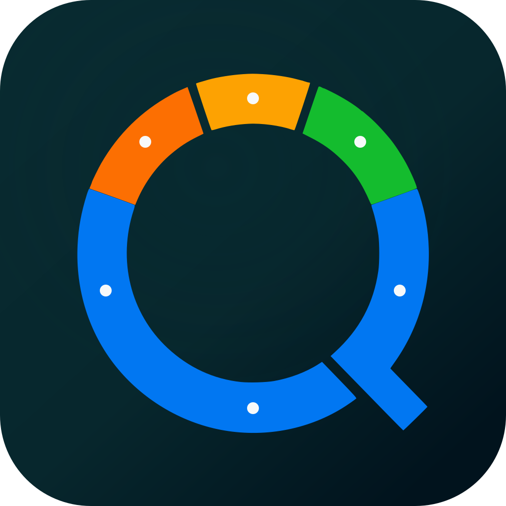
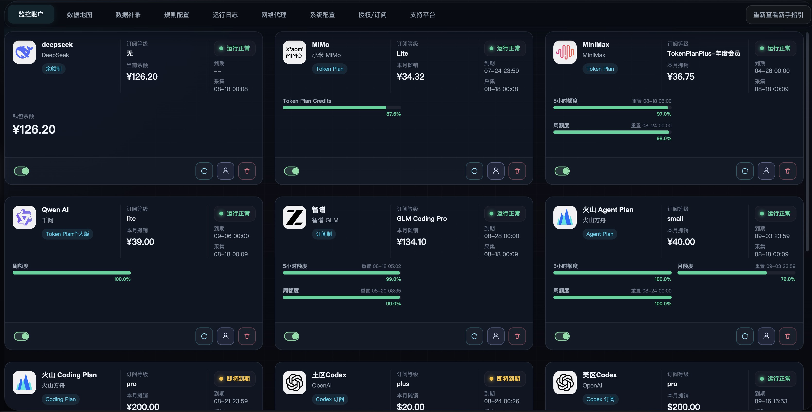
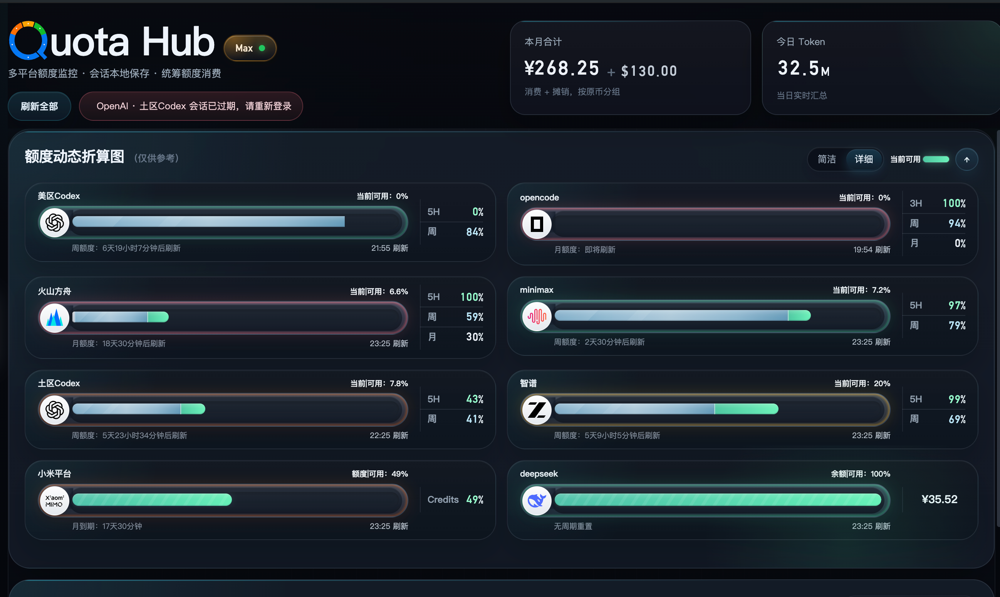
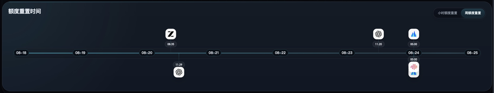
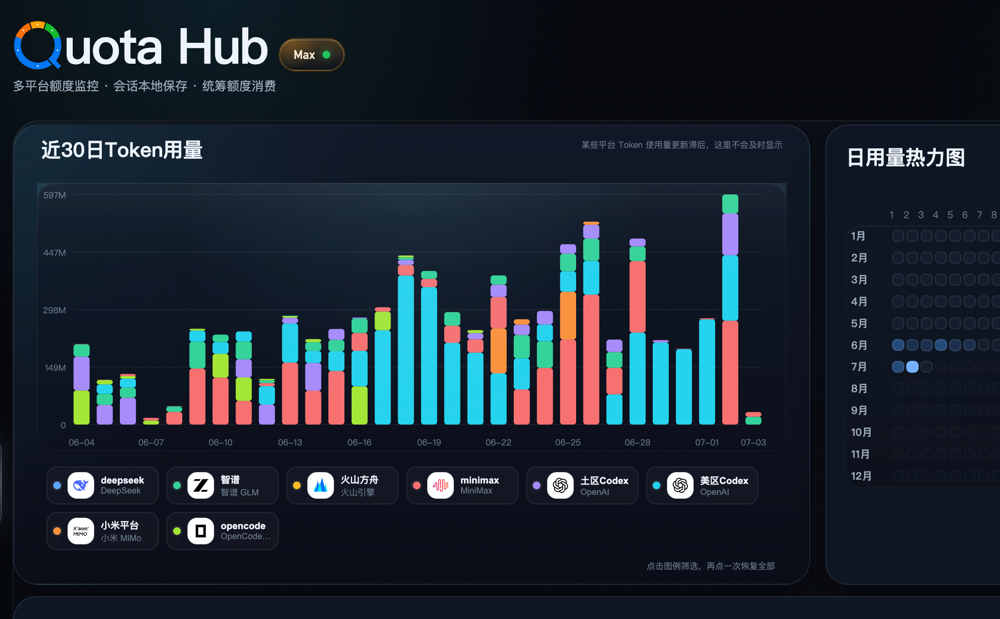
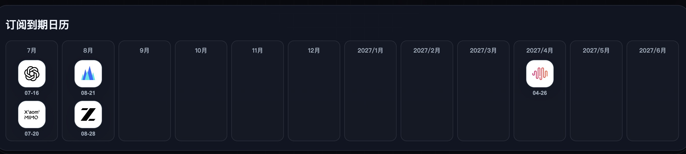
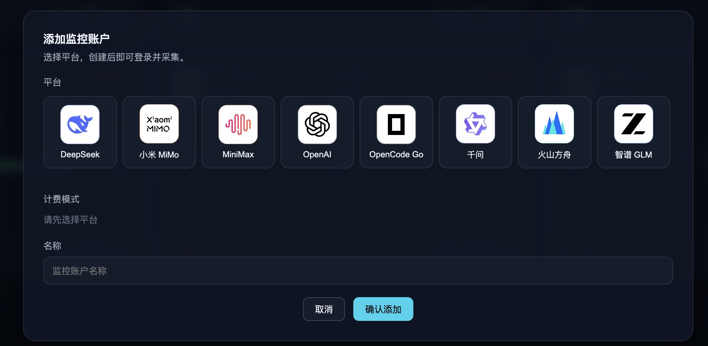

# Quota Hub

**看 token,一个窗口就够。**

AI 额度订阅统一管理 · macOS / Windows

---

把分散在多个 AI 平台后台的额度、消耗、订阅与到期信息,收进同一个清晰的桌面视图。不用再挨个登录控制台翻查——打开 Quota Hub,一眼扫清所有账号状态。

## ✨ 核心能力

### 01 · 集中监控

Token 订阅额度集中监控,多个 AI 平台账号收拢到同一个桌面控制台。

### 02 · 周期折算

不同周期额度折算展示,把「5 小时 / 日 / 周 / 月」不同口径折算成统一可比的视图。

### 03 · 重置窗口

额度重置窗口展示,清晰看到下一次重置的倒计时,知道什么时候「回血」。

### 04 · 消耗分析

Token 消耗汇总分析,趋势与平台分布,消耗节奏一目了然。

### 05 · 到期提醒

订阅到期时间提醒,到期前主动提示,避免突然断档。

### 06 · 快速接入

监控账户添加方便,几步完成新增,本地凭证一处配置。

## 🛡️ 本地优先

Quota Hub 是桌面客户端,**不是云端托管型 SaaS**。优先利用本机会话和安全凭证完成监控,敏感入口始终留在你自己的设备上。

## 📥 下载

前往 [Releases](https://github.com/waedata/quota-hub-releases/releases) 获取最新版本:

- macOS(Apple Silicon)
- Windows

## 🐛 反馈与建议

登录 GitHub 后即可参与:

- **遇到 BUG** → [提交 BUG 报告](https://github.com/waedata/quota-hub-releases/issues/new?template=bug-report.yml)
- **改进建议** → [提交功能建议](https://github.com/waedata/quota-hub-releases/issues/new?template=feature-request.yml)
- **浏览已有讨论** → [Issues](https://github.com/waedata/quota-hub-releases/issues)

## 💬 联系我们

| 微信 | 飞书 |
|:---:|:---:|
|  |  |

扫码获取最新版本、订阅说明与使用支持。

邮箱:[285564292@qq.com](mailto:285564292@qq.com)

---

**Quota Hub** · AI 额度订阅统一管理

